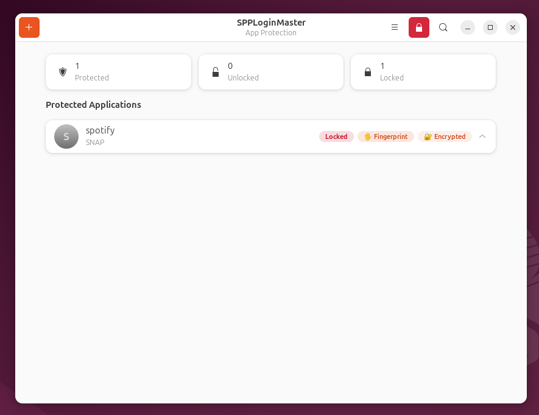
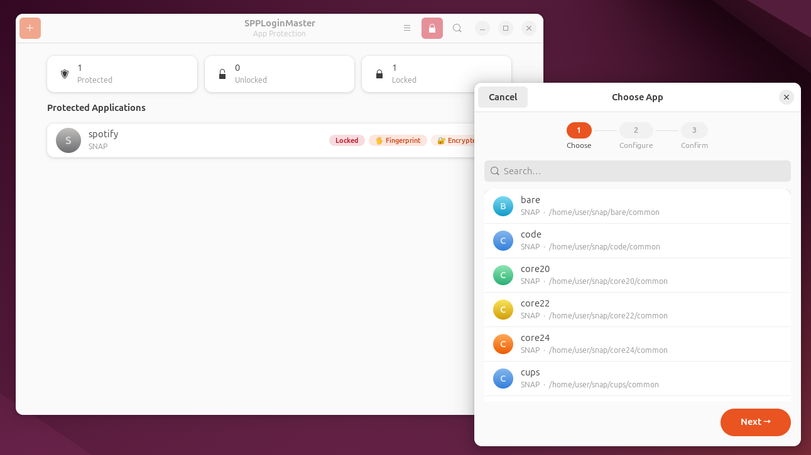
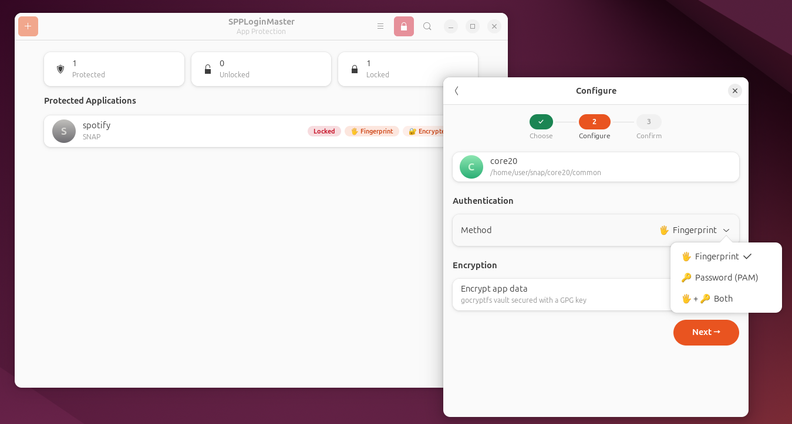
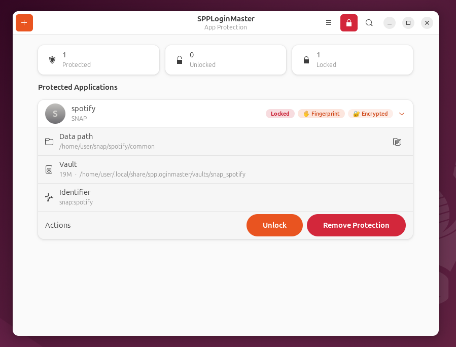
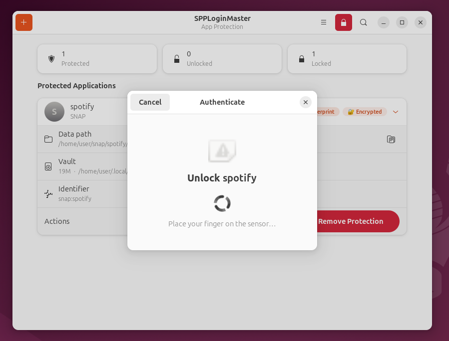
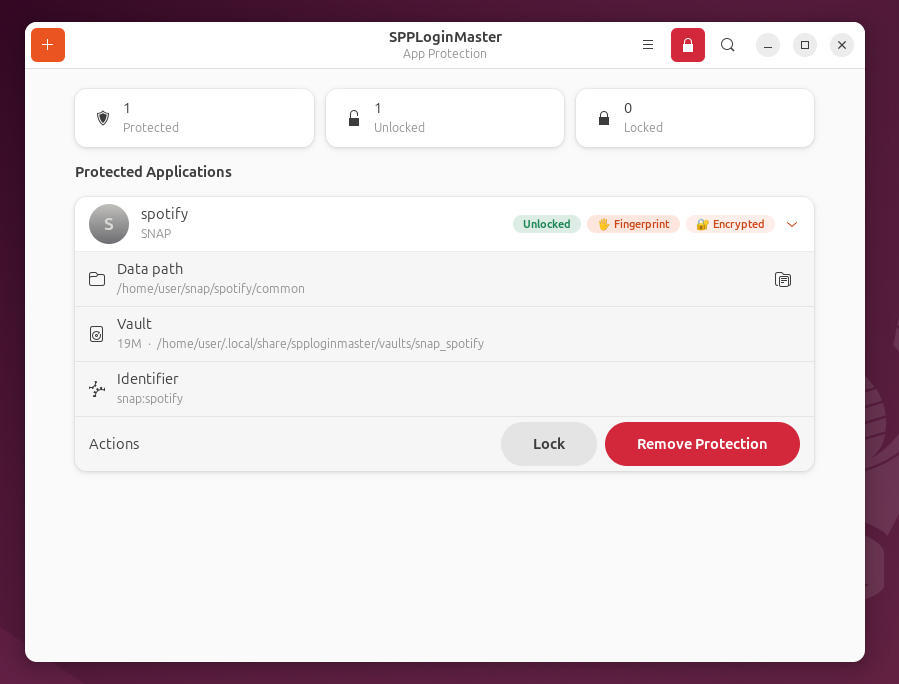

# SPPLoginMaster

Wrap any Linux app with fingerprint or password authentication. App data is encrypted at rest with gocryptfs; the encryption key is protected by GPG symmetric AES-256. Supports snap, flatpak, and .deb apps on Ubuntu 22.04+.



---

## How it works

When you protect an app, SPPLoginMaster:

1. Generates a random 256-bit vault key and encrypts it with GPG (AES-256, SHA-512 S2K, 65M iterations) into `~/.config/spploginmaster/<app>.key.gpg`
2. Initialises a `gocryptfs` vault and migrates the app's existing data into it
3. Replaces the app's `.desktop` launcher with a wrapper script that:
   - Authenticates the user (fingerprint / password / both)
   - Decrypts the GPG keyfile in memory
   - Mounts the vault at the original data path
   - Launches the app, then unmounts when it exits

The app's original data directory becomes a gocryptfs mount point. If the vault is not unlocked, the app starts with an empty data directory — it cannot read any user data.

### Key derivation

| Auth method | How the GPG passphrase is derived |
|---|---|
| **Password** | `PBKDF2-HMAC-SHA256(password, per-app salt, 600 000 iters)` — never stored |
| **Fingerprint** | 32-byte random secret stored in the GNOME keyring (libsecret); released only after a successful fprintd scan |
| **Both** | PBKDF2 passphrase AND fprintd scan both required |

---

## Requirements

```
sudo apt install fprintd gocryptfs fuse gnupg2 zenity libsecret-tools pamtester python3-gi gir1.2-gtk-4.0 gir1.2-adw-1
```

| Package | Purpose |
|---|---|
| `fprintd` | Fingerprint daemon |
| `gocryptfs` | Filesystem encryption (FUSE) |
| `gnupg2` | GPG symmetric encryption of the vault key |
| `libsecret-tools` | GNOME keyring access for fingerprint mode |
| `pamtester` | PAM password verification |
| `zenity` | Dialogs for the wrapper script |
| `python3-gi`, `gir1.2-adw-1` | GTK4/Libadwaita Python bindings |

---

## Installation

```bash
git clone https://github.com/sappafrancesco/SPPLoginMaster.git
cd SPPLoginMaster
chmod +x install.sh
./install.sh
```

This installs the `spp-gui` and `spp-cli` commands system-wide.

---

## GUI

```bash
spp-gui
```

### Protecting an app

Click **+** (or `Ctrl+N`) to open the wizard.

**Step 1 — Choose app.** All installed snap, flatpak, and .deb applications are listed. Already-protected apps are excluded.



**Step 2 — Configure.** Pick the authentication method and whether to encrypt data. If fingerprint is not enrolled, only password is available.



**Step 3 — Confirm.** Review and click *Protect App*. The vault is initialised and the launcher is patched in the background.

### Managing protected apps

Expanding a row shows the data path, vault location, identifier, and action buttons.



Clicking **Unlock** triggers authentication. For fingerprint mode the dialog starts the scan immediately.



After a successful scan the badge switches to **Unlocked** and the vault is mounted.



### Panic button

The red lock icon in the header bar (`Ctrl+Shift+L`) immediately unmounts all vaults. Use this if you need to lock everything at once.

---

## CLI

```bash
# Check dependencies and fingerprint status
spp-cli setup

# Interactive wizard (lists apps, asks auth method)
spp-cli protect

# Non-interactive
spp-cli protect --app-id snap:spotify --auth fingerprint

# Protect without data encryption (not recommended)
spp-cli protect --app-id snap:spotify --auth password --no-encrypt

# List protected apps with mount status
spp-cli list

# Show lock/unlock status
spp-cli status

# Mount vault (prompts for auth)
spp-cli mount snap:spotify

# Unmount vault
spp-cli unmount snap:spotify

# Remove protection (decrypts and restores original data)
spp-cli unprotect snap:spotify

# Lock all vaults immediately
spp-cli panic
```

---

## Configuration

Stored in `~/.config/spploginmaster/apps.json`:

```json
{
  "snap:spotify": {
    "id": "snap:spotify",
    "name": "spotify",
    "type": "snap",
    "auth_method": "fingerprint",
    "encrypt_data": true,
    "vault_path": "~/.local/share/spploginmaster/vaults/snap_spotify",
    "mount_path": "~/snap/spotify/common",
    "launch_cmd": "snap run spotify"
  }
}
```

The GPG-encrypted vault key lives at `~/.config/spploginmaster/<app-id>.key.gpg`.

---

## Security model

| Threat | Coverage |
|---|---|
| Unauthorized app launch | Wrapper requires auth before mounting |
| Physical disk access (stolen drive) | gocryptfs encrypts all app data |
| Direct `snap run` / `flatpak run` bypass | Vault is not mounted → app sees an empty data dir |
| Session hijacking (fingerprint mode) | Requires both a valid fingerprint scan AND an unlocked GNOME keyring |
| Root access | Not covered — root can read `/proc/mem` of a running process regardless |
---

## Project structure

```
SPPLoginMaster/
├── spp/
│   ├── cli.py        # CLI (Click + Rich)
│   ├── gui.py        # GTK4/Libadwaita GUI
│   ├── protect.py    # protect/unprotect orchestration
│   ├── security.py   # fingerprint, GPG, gocryptfs, PBKDF2
│   ├── auth.py       # passphrase retrieval (keyring + PAM)
│   ├── apps.py       # snap/flatpak/.deb discovery
│   ├── launcher.py   # .desktop patching
│   └── config.py     # JSON config
├── install.sh
├── setup.py
└── README.md
```

Open an issue before submitting a pull request.

## License

GPL-3.0 — see [LICENSE](LICENSE)
